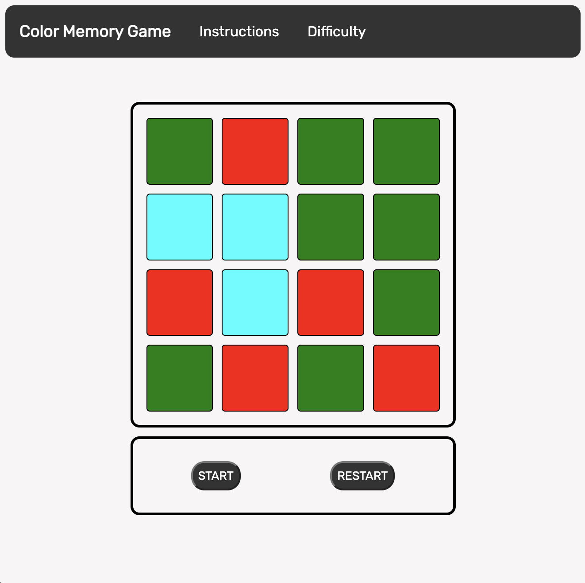
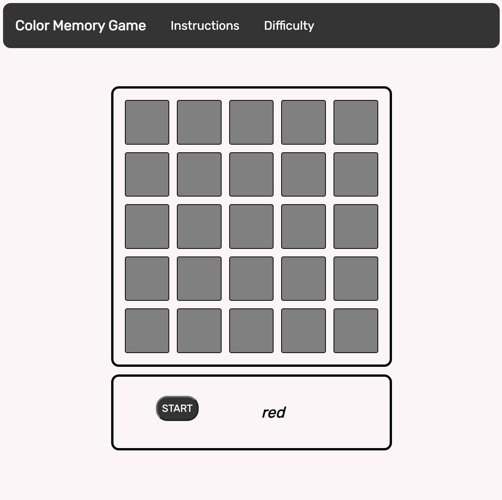
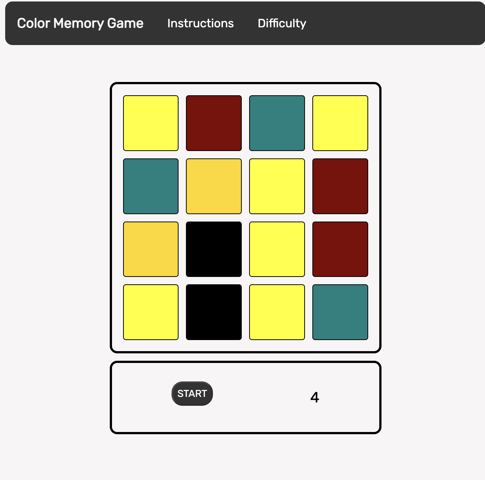

# Color Memory Game

## Release Date: 25th of Jan 2024

### By: Salman BuAli

### **_Description_**

#### Memorise the tiles of every single color then the game will randomly pick one of the colors for you to choose from. @.@

#### Easy: simple 4x4 tiles with random 3 colors aqua, red, and green, UNLIMTED TIME. If you cant win you are a noob 😂

##### Medium: 5x5 tiles that will show a random pattern with the color red, 7 SECONDS ONLY. Its a pattern recognition challenge.

#### Hard: 4x4 tiles and a random pattern from 5 colors is generated black, gold, maroon, yellow, and teal. You will have 10 SECONDS ONLY. The colors might be close to each other hehe 😈.

---

## Screenshots

---

## Technologies Used

- 
- 
- 

---

### **_Credits_**

##### [SEI Markdown HW](https://github.com/SEI-08-Bahrain/u1_hw_markdown)

#### [w3schools] (https://www.w3schools.com/css/css_dropdowns.asp)
